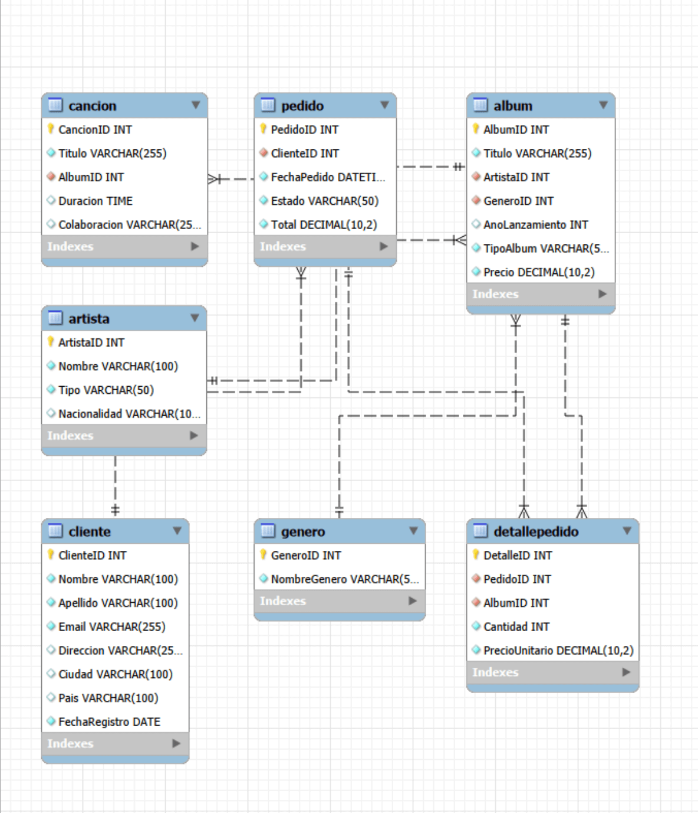

# Proyecto: Base de Datos para Tienda de Musica Online

## Descripci車n del Proyecto

Este repositorio contiene el dise?o y la implementaci車n de una base de datos relacional para una tienda de m迆sica online. El objetivo es proporcionar un entorno de aprendizaje pr芍ctico para SQL, cubriendo desde la creaci車n de tablas hasta consultas complejas, as赤 como servir de ejemplo para el dise?o de bases de datos.

La base de datos permitir芍 gestionar informaci車n sobre artistas, 芍lbumes, canciones, g谷neros, clientes y sus pedidos.

## Dise?o Conceptual y L車gico de la Base de Datos

El dise?o de la base de datos se ha realizado siguiendo los principios de normalizaci車n para asegurar la integridad y eficiencia de los datos. Se han identificado las siguientes entidades principales y sus relaciones:

### Entidades y Atributos

A continuaci車n, se detalla cada entidad (que se convertir芍 en una tabla en la base de datos), sus atributos (columnas), y el rol de las claves primarias (PK) y for芍neas (FK).

#### 1. `Artista`
*   **Descripci車n:** Almacena informaci車n sobre los artistas o bandas de m迆sica.
*   **Atributos:**
    *   `ArtistaID` (PK): Identificador 迆nico para cada artista.
    *   `Nombre`: Nombre del artista o banda.
    *   `Tipo`: Indica si el artista es un 'Solista' o una 'Banda/Grupo'.
    *   `Nacionalidad`: Pa赤s de origen del artista/banda.

#### 2. `Genero`
*   **Descripci車n:** Contiene la lista de g谷neros musicales disponibles, asegurando la consistencia de los datos.
*   **Atributos:**
    *   `GeneroID` (PK): Identificador 迆nico para cada g谷nero.
    *   `NombreGenero`: Nombre del g谷nero musical (Ej: 'Rock', 'Pop', 'Jazz').

#### 3. `Album`
*   **Descripci車n:** Guarda los detalles de los 芍lbumes y singles.
*   **Atributos:**
    *   `AlbumID` (PK): Identificador 迆nico para cada 芍lbum/single.
    *   `Titulo`: T赤tulo del 芍lbum o single.
    *   `ArtistaID` (FK): Referencia al artista al que pertenece el 芍lbum.
    *   `GeneroID` (FK): Referencia al g谷nero musical del 芍lbum.
    *   `AnoLanzamiento`: A?o en que fue lanzado el 芍lbum.
    *   `TipoAlbum`: Indica si es un 'Album' o un 'Single'.
    *   `Precio`: Precio de venta del 芍lbum.

#### 4. `Cancion`
*   **Descripci車n:** Almacena informaci車n sobre las canciones que forman parte de los 芍lbumes.
*   **Atributos:**
    *   `CancionID` (PK): Identificador 迆nico para cada canci車n.
    *   `Titulo`: T赤tulo de la canci車n.
    *   `AlbumID` (FK): Referencia al 芍lbum al que pertenece  la canci車n.
    *   `Duracion`: Duraci車n de la canci車n.
    *   `Colaboracion`: Nombres de artistas colaboradores, si los hay (opcional).

#### 5. `Cliente`
*   **Descripci車n:** Contiene los datos de los usuarios que realizan compras en la tienda.
*   **Atributos:**
    *   `ClienteID` (PK): Identificador 迆nico para cada cliente.
    *   `Nombre`: Nombre del cliente.
    *   `Apellido`: Apellido del cliente.
    *   `Email`: Direcci車n de correo electr車nico del cliente (debe ser 迆nica).
    *   `Direccion`: Direcci車n postal del cliente.
    *   `Ciudad`: Ciudad del cliente.
    *   `Pais`: Pa赤s del cliente.
    *   `FechaRegistro`: Fecha en que el cliente se registro.

#### 6. `Pedido`
*   **Descripci車n:** Registra la informaci車n general de cada compra realizada por los clientes.
*   **Atributos:**
    *   `PedidoID` (PK): Identificador 迆nico para cada pedido.
    *   `ClienteID` (FK): Referencia al cliente que realiz車 el pedido.
    *   `FechaPedido`: Fecha y hora en que se realiz車 el pedido.
    *   `Estado`: Estado actual del pedido (Ej: 'Pendiente', 'Enviado', 'Completado', 'Cancelado').
    *   `Total`: Costo total del pedido.

#### 7. `DetallePedido`
*   **Descripci車n:** Almacena los elementos espec赤ficos (芍lbumes) incluidos en cada pedido. Representa una l赤nea de pedido.
*   **Atributos:**
    *   `DetalleID` (PK): Identificador 迆nico para cada l赤nea de detalle del pedido.
    *   `PedidoID` (FK): Referencia al pedido al que pertenece este detalle.
    *   `AlbumID` (FK): Referencia al 芍lbum/single comprado en esta l赤nea de pedido.
    *   `Cantidad`: Cantidad de unidades de ese 芍lbum/single compradas.
    *   `PrecioUnitario`: Precio del 芍lbum/single en el momento de la compra (para mantener un registro hist車rico).

---

## Diagrama Entidad-Relaci車n (ERD)

*Breve descripci車n de c車mo leer el ERD: Las cajas representan tablas, las l赤neas representan relaciones (uno a muchos, uno a uno), y las PK/FK indican c車mo se conectan las tablas.*

---

## Configuraci車n del Entorno (MySQL)

Para trabajar con esta base de datos, necesitar芍s tener instalado MySQL.

### Requisitos:
*   MySQL Server (versi車n 8.0 o superior recomendada)
*   Un cliente MySQL (como MySQL Workbench, DBeaver, o la l赤nea de comandos de MySQL)

### Pasos para configurar:
1.  Instalaci車n de MySQL.
2.  Creaci車n de la base de datos `tienda_musica` a trav谷s de los scripts SQL para la creaci車n de la propia base de datos e inserci車n de datos de ejemplo.

---

## Ejercicios y Consultas SQL

Esta secci車n contendr芍 una serie de ejercicios pr芍cticos de SQL, organizados por complejidad creciente, para interactuar con la base de datos de la tienda de m迆sica.

*   `01_creacion_tablas.sql`
*   `02_insercion_datos.sql`
*   `03_consultas_basicas_select.sql`
*   `...`

---

## C車mo Empezar

1.  Clona este repositorio: `git clone https://github.com/juanehkotech/SQL_Learning_Hub.git`
2.  Configura tu entorno MySQL (ver secci車n "Configuraci車n del Entorno").
3.  Ejecuta los scripts SQL en orden para crear la base de datos y cargar los datos.
4.  Empieza a practicar con los ejercicios en la carpeta `exercises/`.

---

## Contribuciones

Las contribuciones son bienvenidas! Si tienes sugerencias para mejorar el dise?o, a?adir m芍s ejercicios o corregir errores, por favor, abre un 'issue' o env赤a un 'pull request'.

---